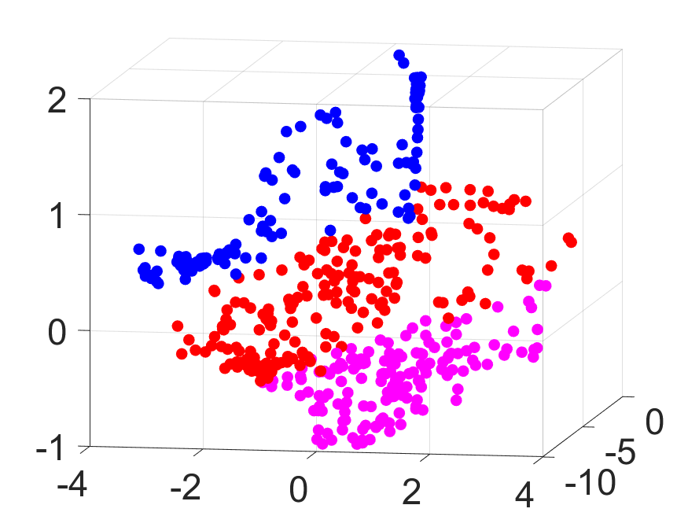
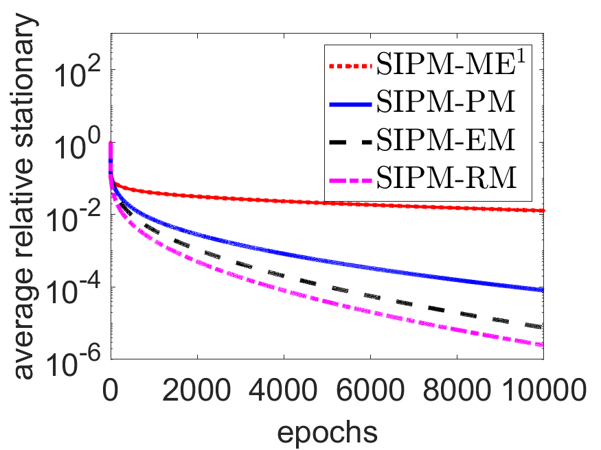
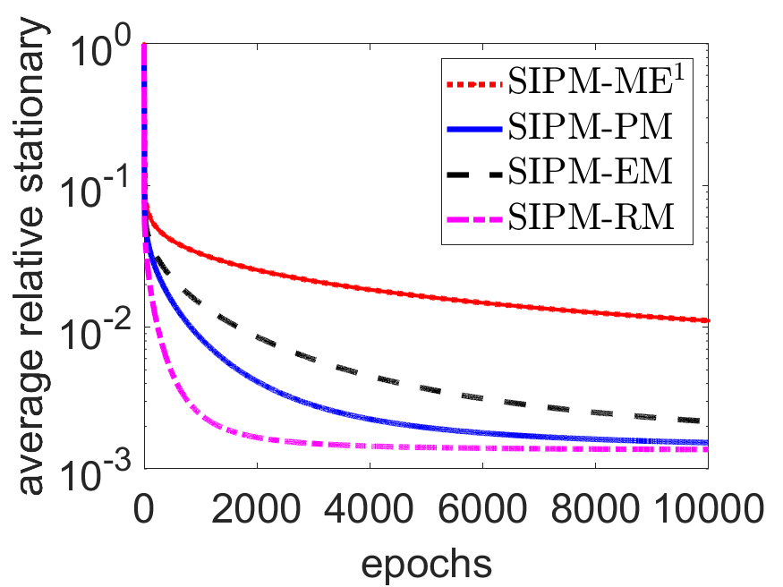
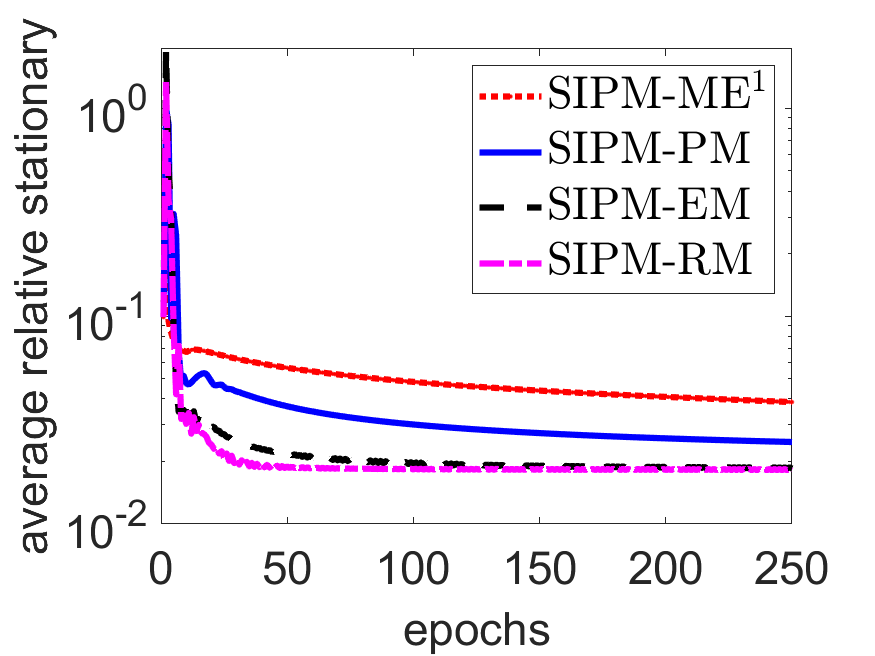

# Stochastic Interior-Point Methods for Smooth Conic Optimization with Applications

This repository contains the implementation code for the paper "Stochastic Interior-Point Methods for Smooth Conic Optimization with Applications". The code implements stochastic interior-point methods for solving smooth conic optimization problems, with a focus on semidefinite programming (SDP) and multi-task optimization applications.

## Code Summary

This implementation serves two main purposes:
1. To reproduce the experimental results presented in our paper on Stochastic Interior-Point Methods
2. To provide a practical implementation of stochastic IPM algorithms for smooth conic optimization problems

## Repository Structure

```
.
├── SDPT3-4.0/           # Third-party solver package required for comparison
├── base/                # Core implementation files for SIPM algorithms
├── data/               # Dataset files for experiments
├── result/             # Directory for storing experimental results
├── src/                # Source code for main implementations
├── Test_SDP.m         # Main script for SDP experiments
├── Test_socp.m        # Script for SOCP experiments
├── Test_socp2.m       # Additional SOCP test script
├── multi_task.m       # Script for multi-task optimization experiments
└── readme.md          # Documentation file
```

### Directory Details:
- `base/`: Contains the fundamental implementations of the SIPM algorithms
- `data/`: Stores test datasets and benchmark problems
- `src/`: Contains the source code for main algorithm implementations
- `result/`: Stores experimental outputs and analysis results
- `SDPT3-4.0/`: Contains the SDPT3 solver package used for comparison

## Requirements

- MATLAB (R2019b or later recommended)
- SDPT3-4.0 solver package (included in repository)

## How to Run the Code

### For SDP Experiments:
1. Start MATLAB
2. Navigate to the repository root directory
3. Run the following command:
```matlab
run Test_SDP.m
```

#### Results
<div style="display: flex; justify-content: space-around; flex-wrap: wrap; gap: 20px;">
  <div style="text-align: center; flex: 0 0 23%;">  <!-- 设置 flex 子项宽度 -->
    
  </div>
  <div style="text-align: center; flex: 0 0 23%;">  <!-- 设置 flex 子项宽度 -->
    
  </div>
  <div style="text-align: center; flex: 0 0 23%;">  <!-- 设置 flex 子项宽度 -->
    
  </div>
  <div style="text-align: center; flex: 0 0 23%;">  <!-- 设置 flex 子项宽度 -->
    
  </div>
</div>

<p style="text-align: center;">Convergence behavior of the relative objective value and average relative stationary</p>
<br><br>

<div style="display: flex; justify-content: space-around;">
<div style="text-align: center;">
  
  </div>
  <div style="text-align: center;">
  
  </div>
  <div style="text-align: center;">
  
  </div>
  <div style="text-align: center;">
    
    </div>
</div>
<p style="text-align: center;"> Clustering results at the
1st, 333rd, 666th, and 1000th data observation</p>

### For SOCP Experiments:
1. Start MATLAB
2. Navigate to the repository root directory
3. Execute either:
```matlab
run Test_socp.m
```
or
```matlab
run Test_socp2.m
```

#### Results
<div style="display: flex; justify-content: space-around;">
<div style="text-align: center;">
  
  </div>
  <div style="text-align: center;">
  
  </div>
  <div style="text-align: center;">
  
  </div>
  <div style="text-align: center;">
  
  </div>
</div>
<p style="text-align: center;">Convergence behavior of the relative objective value and average relative stationary</p>
<br><br>

### For Multi-task Optimization:
1. Start MATLAB
2. Navigate to the repository root directory
3. Execute:
```matlab
run multi_task.m
```

#### Results
<div style="display: flex; justify-content: space-around;">
<div style="text-align: center;">
  
</div>
  <div style="text-align: center;">
  
</div>
  <div style="text-align: center;">
  
</div>
  <div style="text-align: center;">
  
  </div>
</div>
<p style="text-align: center;">Convergence behavior of the relative objective value and average relative stationary</p>
<br><br>

<div style="display: flex; justify-content: space-around;">
<div style="text-align: center;">
  
  </div>
  <div style="text-align: center;">
  
  </div>
</div>

<p style="text-align: center;"> Loss per task for the training (left five) and validation (right five) datasets</p>
<br><br>

### Experiment Configuration
- Modify parameters in the respective .m files to adjust experimental settings
- Results will be automatically saved in the `result/` directory
- For custom datasets, place them in the `data/` directory and modify the data loading path in the scripts accordingly

## Notes
- All codes are implemented in MATLAB, so no compilation is necessary
- Make sure all paths are properly set before running experiments
- Check the `result/` directory for output files after running experiments


