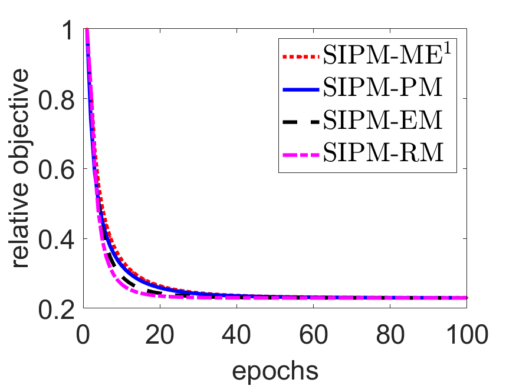
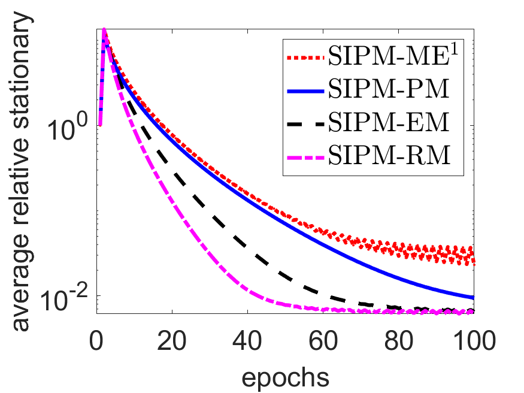
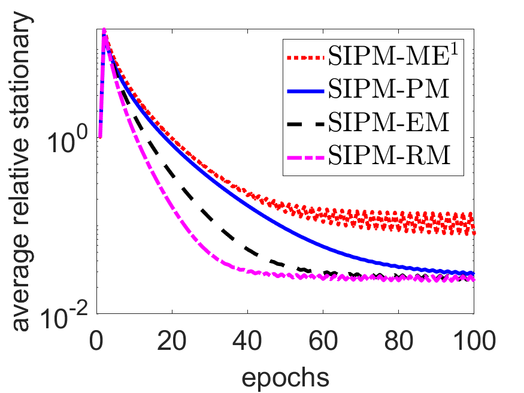
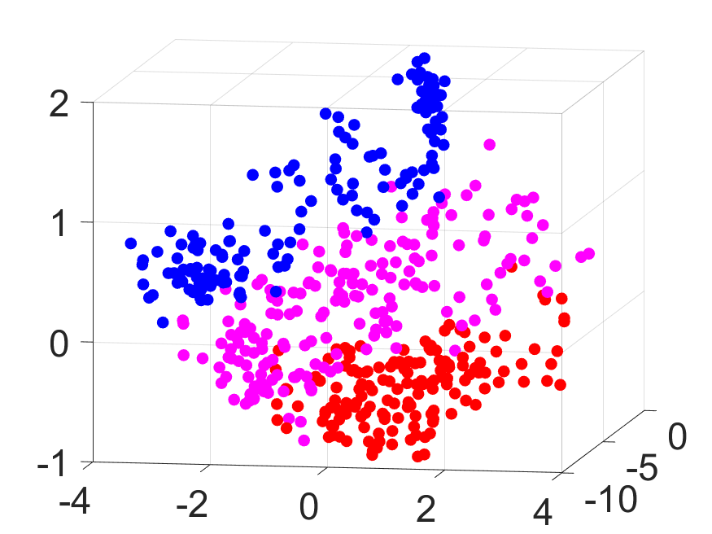
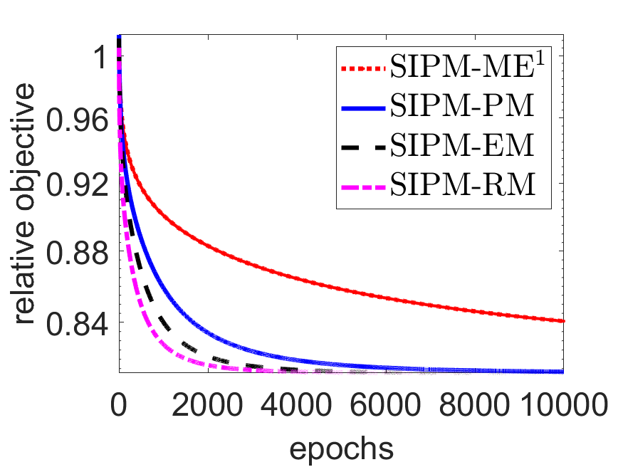
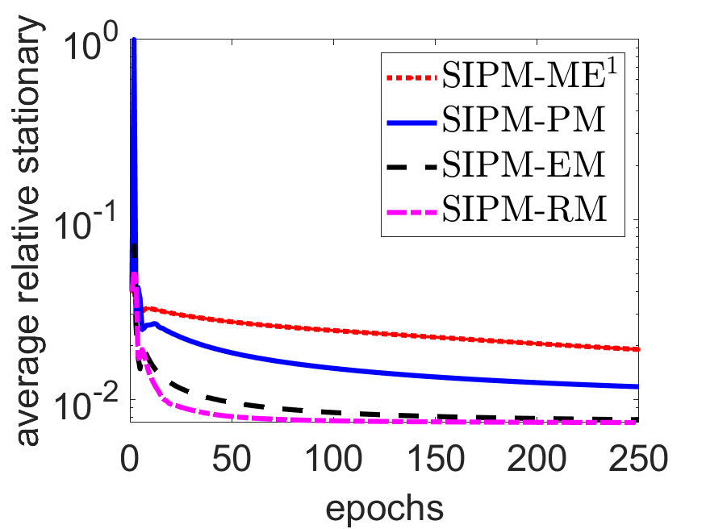

# Stochastic Interior-Point Methods for Smooth Conic Optimization with Applications

This repository contains the implementation code for the paper "Stochastic Interior-Point Methods for Smooth Conic Optimization with Applications". The code implements stochastic interior-point methods for solving smooth conic optimization problems, with a focus on semidefinite programming (SDP) and multi-task optimization applications.

## Code Summary

This implementation serves two main purposes:
1. To reproduce the experimental results presented in our paper on Stochastic Interior-Point Methods
2. To provide a practical implementation of stochastic IPM algorithms for smooth conic optimization problems

## Repository Structure

```
.
├── SDPT3-4.0/           # Third-party solver package required for comparison
├── base/                # Core implementation files for SIPM algorithms
├── data/               # Dataset files for experiments
├── result/             # Directory for storing experimental results
├── src/                # Source code for main implementations
├── Test_SDP.m         # Main script for SDP experiments
├── Test_socp.m        # Script for SOCP experiments
├── Test_socp2.m       # Additional SOCP test script
├── multi_task.m       # Script for multi-task optimization experiments
└── readme.md          # Documentation file
```

### Directory Details:
- `base/`: Contains the fundamental implementations of the SIPM algorithms
- `data/`: Stores test datasets and benchmark problems
- `src/`: Contains the source code for main algorithm implementations
- `result/`: Stores experimental outputs and analysis results
- `SDPT3-4.0/`: Contains the SDPT3 solver package used for comparison

## Requirements

- MATLAB (R2019b or later recommended)

## How to Run the Code

### For clustering data streams problems:
$$
\min_{W\in\mathbb{R}^{d\times d}} \frac{1}{p}\sum_{i=1}^p\{ A_i,W\} + \tau\sum_{i=1}^d\ln(\gamma +\lambda_i(W))\ \ \mathrm{s.t.}\ \ W\in\mathbb{S}^{d}_+,\ \ We_d = e_d,\ \ \langle I_d,W\rangle=k,
$$

where $\{A_i\}_{i=1}^p$ are computed from data streams, $\tau\sum_{i=1}^d\ln(\gamma +\lambda_i(W))$ is a nonconvex regularizer that imposes low rankness, with $\tau$ and $\gamma$ as tuning parameters, and $e_d$ and $I_d$ denote the $d$-dimensional  all-one vector and the $d\times d$ identity matrix, respectively.

1. Start MATLAB
2. Navigate to the repository root directory
3. Run the following command:
```matlab
run Test_SDP.m
```

#### Results
<div style="display: flex; justify-content: space-around;">
  

  

  

  

</div>

<center>&nbsp;&nbsp;&nbsp;&nbsp;&nbsp;&nbsp;&nbsp;&nbsp;&nbsp;&nbsp;&nbsp;&nbsp;&nbsp;&nbsp;&nbsp; Convergence behavior of the relative objective value and average relative stationary</center>


<br><br>

<div style="display: flex; justify-content: space-around;">
  
  
  
  
</div>

<center>&nbsp;&nbsp;&nbsp;&nbsp;&nbsp;&nbsp;&nbsp;&nbsp;&nbsp;&nbsp;&nbsp;&nbsp;&nbsp;&nbsp;&nbsp;Clustering results at the
1st, 333rd, 666th, and 1000th data observation</center>


### For robust learning with chance constraints:

$$
\min_{w\in\mathbb{R}^d,\theta,v\ge 0}  \frac{1}{p}\sum_{i=1}^p\phi(w^Ta_i - b_i) + \lambda_1\theta + \lambda_2 v\quad\mathrm{s.t.}\quad (w,v)\in \mathbb{Q}^{d+1},\quad (\Sigma^{1/2}w,\sqrt{\eta}\theta)\in \mathbb{Q}^{d+1},
$$

where $\phi(\cdot)$ is the loss, $\lambda_1,\lambda_2>0$ are tuning parameters, and $\mathbb{Q}^{d+1}\doteq\{(u,t)\in\mathbb{R}^d\times\mathbb{R}_+:\|u\|\le t\}$ denotes the second-order cone.
1. Start MATLAB
2. Navigate to the repository root directory
3. Execute either:
```matlab
run Test_socp.m
```
or
```matlab
run Test_socp2.m
```

#### Results
<div style="display: flex; justify-content: space-around;">
  
  
  
  
</div>
<p style="text-align: center;">&nbsp;&nbsp;&nbsp;&nbsp;&nbsp;&nbsp;&nbsp;&nbsp;&nbsp;&nbsp;&nbsp;&nbsp;&nbsp;&nbsp;&nbsp; Convergence behavior of the relative objective value and average relative stationary</p>
<br><br>

### For multi-task optimization problems:
$$
\min_{W\in\mathbb{R}^{p\times d},\Sigma\in\mathbb{R}^{p\times p}}\frac{1}{p}\sum_{i=1}^p \frac{1}{m} \sum_{j=1}^{m}\ell(w_i,a_{ij}) + \lambda\mathrm{tr}(W^TP(\Sigma)W) \quad \mathrm{s.t.}\quad \Sigma\in\mathbb{S}_+^p,\quad \mathrm{tr}(\Sigma)=1,  
$$

where $W = [w_1, \ldots, w_p]^T$, $\mathbb{S}^p_+$ denotes the positive semidefinite cone, $\ell(\cdot, \cdot)$ is the loss function, $w_i$ and $\{a_{ij}\}_{j=1}^{m}$ are respectively the model weight and the training set for the $i$th task, $1 \le i \le p$, $\lambda>0$ is a tuning parameter, $P : \mathbb{R}^{p \times p} \to \mathbb{R}^{p \times p}$ is a given map that controls the interaction between $W$ and $\Omega$, and $\mathrm{tr}(\cdot)$ denotes the trace of a matrix.

1. Start MATLAB
2. Navigate to the repository root directory
3. Execute:
```matlab
run multi_task.m
```

#### Results
<div style="display: flex; justify-content: space-around;">
  
  
  
  
</div>
<p style="text-align: center;">&nbsp;&nbsp;&nbsp;&nbsp;&nbsp;&nbsp;&nbsp;&nbsp;&nbsp;&nbsp;&nbsp;&nbsp;&nbsp;&nbsp;&nbsp; Convergence behavior of the relative objective value and average relative stationary</p>
<br><br>

<div style="display: flex; justify-content: space-around;">
  
  
</div>

<p style="text-align: center;">&nbsp;&nbsp;&nbsp;&nbsp;&nbsp;&nbsp;&nbsp;&nbsp;&nbsp;&nbsp;&nbsp;&nbsp;&nbsp;&nbsp;&nbsp; Loss per task for the training (left five) and validation (right five) datasets</p>
<br><br>

### Experiment Configuration
- Modify parameters in the respective .m files to adjust experimental settings
- Results will be automatically saved in the `result/` directory
- For custom datasets, place them in the `data/` directory and modify the data loading path in the scripts accordingly

## Notes
- All codes are implemented in MATLAB, so no compilation is necessary
- Make sure all paths are properly set before running experiments
- Check the `result/` directory for output files after running experiments


